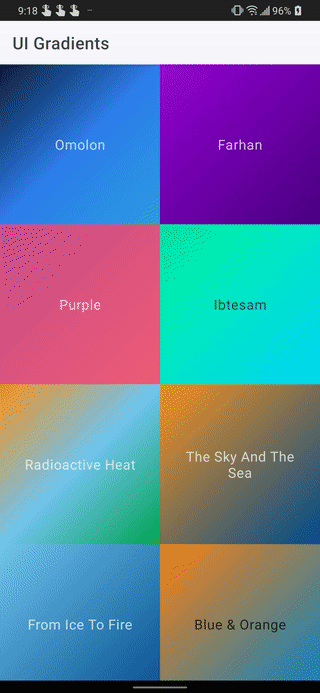
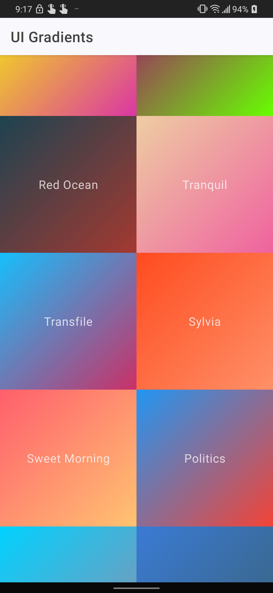
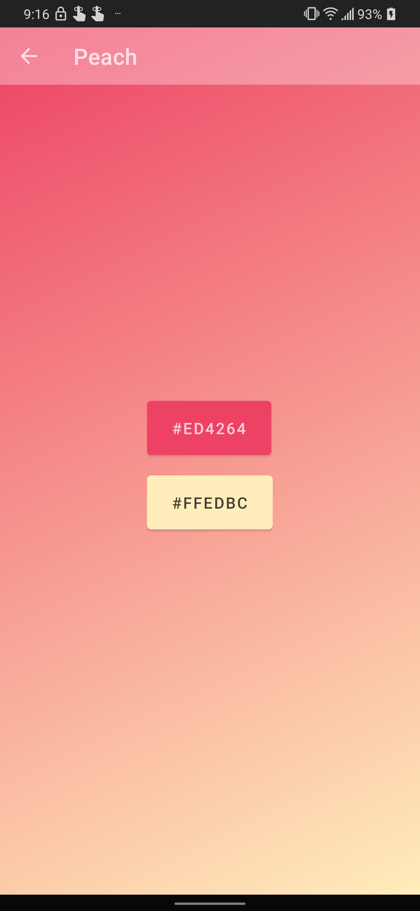

# Gradient app

A little demo project I made, originally part of my "app a day" experiment. A client for
[UIGradients](https://uigradients.com). Displays a list of all available gradients and allows the
user to view/copy colors to the clipboard.

### Tech stack
 - Dagger2
 - Retrofit + OkHttp + Moshi
 - Room 
 - Kotlin + Coroutines
 - Jetpack ViewModel + Lifecycle components
 - CoordinatorLayout

## Demos

